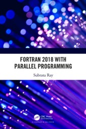
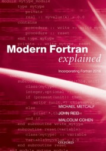
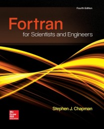
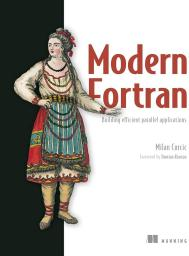

# Notes on Fortran

This page contains my personal notes on subjects related to Fortran which I find interesting and write down over time. It is a work in progress and subject to constant change.

## Jupyter Notebooks

Some interesting things I collect over time.

- pointerassignment.[[ipynb](notebooks/pointerassignment.ipynb)|[html](notebooks/pointerassignment.md)] - what does => (equals greater than) mean in Fortran? .
- implicit.[[ipynb](notebooks/implicit.ipynb)|[html](notebooks/implicit.md)] - Fortran 2018 `implicit none (external | type)` .
- csv.[[ipynb](notebooks/csv.ipynb)|[html](notebooks/csv.md)] - example of using CSV files in Fortran.
- flang-aarch64.[[ipynb](notebooks/flang-aarch64.ipynb)|[html](notebooks/flang-aarch64.md)] - example of the Flang compiler (and Jupyter) running on a smartphone using Termux. The processor is the Snapdragon 617 octa-core ARMv8 Cortex-A5HTML3 64-bit.
- fortran-assembly.[[ipynb](notebooks/fortran-assembly.ipynb)|[html](notebooks/fortran-assembly.md)] - shows the assembly code generated by the gfortran compiler.
- small-executable.[[ipynb](notebooks/small-executable.ipynb)|[html](notebooks/small-executable.md)] - some exercises to try to better understand the creation of executables by a compiler. Some code snippets that I collect over time.
- snippets.[[ipynb](notebooks/snippets.ipynb)|[html](notebooks/snippets.md)] - some code snippets that I collect over time.

## About Fortran

Fortran is one of the first programming languages and over time it has been improved and updated, and today it can be considered a modern programming language, including support for object-oriented programming (type extension and inheritance, polymorphism, dynamic type allocation, procedures linked to type), and support for parallel programming (coarray, looping , array assignment, vectorization help, etc.). It is a productive, relatively small, high-level language that is easy to learn and use, allowing programmers to focus on the program's algorithm without having to worry about too many technical details. An important feature is that it generally produces fast code, sometimes as fast as C, without the need to resort to low/medium level languages. An interesting detail is that Python/Numpy/[F2PY](https://numpy.org/doc/stable/f2py/) has good integration, allowing you to use Fortran in parts that require performance, and in this way trying to combine the best of both worlds, especially when using Python's interactivity and easy prototyping features. Fortran is used in various areas of science and engineering, such as numerical prediction of climate and oceans, computational fluid dynamics, applied mathematics, statistics and finance, high-performance computing and supercomputers.

## Fortran 2023

- Standard and documents. <https://wg5-fortran.org/f2023.html>
- Fortran 2023 draft. <https://j3-fortran.org/doc/year/21/21-007.pdf>
- Modern FORTRAN Explained 6th ed. <https://www.amazon.com.br/Modern-Fortran-Explained-Incorporating-2023/dp/0198876580>
- Intel compiler including some Fortran 2023 features. <https://www.intel.com/content/www/us/en/developer/articles/release-notes/oneapi-fortran-compiler-release-notes.html>
- Summary of changes [J Reid].: <https://fortran.bcs.org/2022/AGM22_Reid.pdf>
- New features [J Reid]. <https://wg5-fortran.org/N2201-N2250/N2212.pdf>

## Fortran 2018

JTC1/SC22/WG5, Fortran 2018, ISO/IEC 1539:2018

- JTC1/SC22 is the international standardization subcommittee for programming languages, their environments and system software interfaces. <http://wg5-fortran.org/f2018.html>
- Specs. <http://fortranwiki.org/fortran/show/Fortran+2018>
- Fortran 2018 Examples. <https://github.com/scivision/fortran2018-examples>
- Fortran 2018 Features supported by GNU Fortran. <https://gcc.gnu.org/wiki/Fortran2018Status>
- Fortran 2018 Interpretation Document. <https://j3-fortran.org/doc/year/18/18-007r1.pdf>
- TS 18508 Additional Parallel Features in Fortran. <http://isotc.iso.org/livelink/livelink?func=ll&objId=17288706&objAction=Open>

## Fortran 2008

Considering that F2018 is a small revision of F2008, then most of the features are the same.

- Fortran 2008 Features supported by GNU Fortran. <https://gcc.gnu.org/wiki/Fortran2008Status>
- Specs. <http://fortranwiki.org/fortran/show/Fortran+2008>

## Intel Fortran

Intel oneAPI Toolkits are available at no cost and do not require license files. Includes *ifort* Intel Fortran Compiler Classic (Full 77, 90, 95, 2003, 2008, and 2018), and *ifx* Intel Fortran Compiler Beta (Full 77, 90, 95, and partial 2003). *ifx* uses the LLVM back-end technology and is released as a Beta version for users interested in trying **Intel Gen9 GPU** offloading, which ifort does not support.

- Intel ifort - full implementation of the Fortran 2018 standard. Free Intel Software Development Tools. <https://software.intel.com/content/www/us/en/develop/articles/free-intel-software-developer-tools.html>
- Intel oneAPI - Intel oneAPI Toolkit, free, Fortran 2018. Intel Fortran Compiler for oneAPI Release Notes. <https://software.intel.com/content/www/us/en/develop/articles/intel-oneapi-fortran-compiler-release-notes.html>
- oneAPI announce on fortran-lang - Intel compiler free as part of oneAPI. Intel releases oneAPI Toolkit, free, Fortran 2018 - Announcements - Fortran Discourse. <https://fortran-lang.discourse.group/t/intel-releases-oneapi-toolkit-free-fortran-2018/471>
- Install Using Package Managers. Install Using Package Managers.  <https://software.intel.com/content/www/us/en/develop/documentation/installation-guide-for-intel-oneapi-toolkits-linux/top/installation/install-using-package-managers.html>
- Intel oneAPI Developer Tools - Introduction and Install. Intel oneAPI Developer Tools -- Introduction and Install. <https://www.pugetsystems.com/labs/hpc/Intel-oneAPI-Developer-Tools----Introduction-and-Install-2054/>
- Intel oneAPI AI Analytics Toolkit - Introduction and Install with conda. Intel oneAPI AI Analytics Toolkit -- Introduction and Install with conda. <https://www.pugetsystems.com/labs/hpc/Intel-oneAPI-AI-Analytics-Toolkit----Introduction-and-Install-with-conda-2068/>

## NVF

NVIDIA CUDA Fortran compiler and tool chain, former PGI compilers, supports F2003 and many features of F2008, CUDA, SIMD vectorization, OpenACC and OpenMP for multicore x86-64, Arm, and OpenPOWER CPUs.

- CUDA Fortran. <https://developer.nvidia.com/cuda-fortran>
- Programming guide. <https://docs.nvidia.com/hpc-sdk/compilers/cuda-fortran-prog-guide>

## F2PY

- F2PY provide a connection between Python and F90 languages, and allows you to bring together the best of both worlds. It is not a replacement for the F90, it is just a way to take advantage of the rapidly developing features of the Python ecosystem, and in this way without having to reinvent the wheel. <https://numpy.org/doc/stable/f2py/>
- Perhaps the best way to use it is in conjunction with Jupyter Notebook, as in this example (note the use of both languages): <https://gist.github.com/shane5ul/79340646ba0a4487c9da50b805215369>

## Assembly

For debugging and optimization purposes it is important to know the "assembly" language generated by a compiler. I have some [assembly notes in a separate documentation](https://efurlanm.github.io/ldi/assembly/).

## Links of interest

- Notes from a [Fortran 90 course](https://web.archive.org/web/20220814061655/https://www.personal.psu.edu/jhm/f90/lectures/quickref.html) taught by Dr. Mahaffy in 1997.
- [Putting Fortran's object-related features to practical use](<https://en.wikipedia.org/wiki/User:RBaSc/draft_ftnoo>), by RBaSc (unpublished draft). The demonstration codes can be found in the object_based folder of the [Github repository](https://github.com/reinh-bader/object_fortran) .
- [Programming in Modern Fortran](https://cyber.dabamos.de/programming/modernfortran/). HyperText-based introduction to programming in Fortran 2003, 2008, 2018, and 2023 on Unix .
- [FortRun bookmarks](https://github.com/FortRun/resources/) .
- [Listing of open source and commercial compilers](https://fortran-lang.org/compilers/), by fortran-lang.org .
- BCS Fortran Specialist Group. [Open forum for Fortran users](https://fortran.bcs.org/) .
- WG5 ISO IEC [Fortran Standards](https://wg5-fortran.org/).
- [US Fortran](https://j3-fortran.org) Programming Language Standards Technical Committee .
- [High Performance Fortran (HPF)](https://www.netlib.org/hpf/index.html). Extensions to F90 .
- Tutorialspoint. [Learn Fortran](https://www.tutorialspoint.com/fortran/). Tutorial designed for beginners .
- Tutorialspoint. [Online Fortran compiler](https://www.tutorialspoint.com/compile_fortran_online.php). Compile and Execute FORTRAN-95 Online (GNU Fortran, GCC) .
- SHENE, Dr.C.-K. Michigan Technological University. [Fortran 90 Tutorial](https://pages.mtu.edu/~shene/COURSES/cs201/NOTES/fortran.html) .
- PAGE, Dr.C. University of Leicester, UK. Clive Page's list of [Fortran Resources](https://www.star.le.ac.uk/~cgp/fortran.html) .

## Videos of interest

- [The IBM 1401 compiles and runs FORTRAN II](https://youtu.be/uFQ3sajIdaM). 1959 IBM mainframe computer at the Computer History Museum. 63-pass Fortran compiler that ran in only 8 k of core. Compiles to bytecode which is then executed by an interpreter. The video description includes several links and information.
- [FortranCon2020 [Keynote]: Fortran 2018...and Beyond](https://youtu.be/mn8QMp6J3R0). Includes an overview of what's new in Fortran 2018.
- [FortranCon2020 [SP]: Parallelization of a Legacy Software through Fortran 2018 Standard](https://youtu.be/ib4ZZ7xJwJk). Results of a modernization and parallelization of an existing application developed by the Brazilian Electrical Energy Research Center (Cepel).
- [First Experiences with Parallel Application Development in Fortran 2018](https://youtu.be/01-ez4v4YPc). Performance results and scalability of algorithms from the National Center for Atmospheric Research (NCAR), using Fortran 2018 and running on platforms with up to 98,000 cores.
- [Modern Fortran by Example](https://www.youtube.com/user/hexafoil/videos). Series of video tutorials.

## Selected books

   

(click on the book picture to see more details)

## Other works

- [My version of PARF](<https://github.com/efurlanm/ml/tree/main/parf>) (Parallel Random Forest) algorithm, MPI-enabled, compiled with Intel Fortran 2021.2 .

## Random bookmarks

- Post on Hacker News: [use modern code/tools for glue, keep your climate models in FORTRAN](https://news.ycombinator.com/item?id=23847527).
- Blog: [Implicit None](https://web.archive.org/web/20160109190730/http://implicitnone.com/) - Ideas, suggestions, code hints & tips for Fortran enthusiasts.

 Last edited: 2025-03-08 10:20:41
